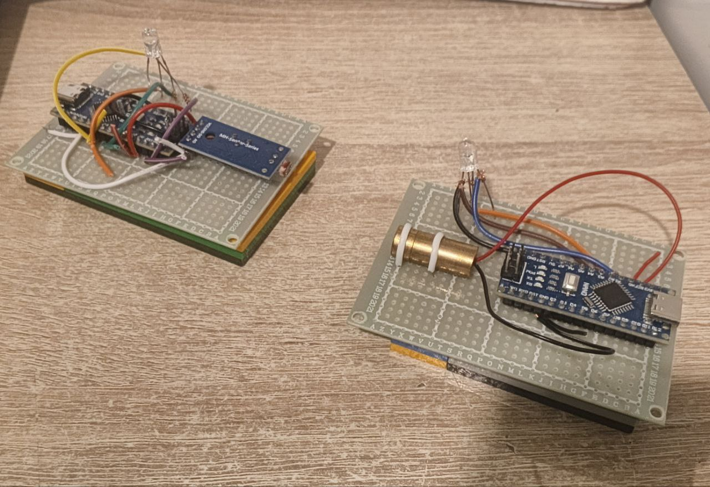

# Лазерный приёмник-передатчик
<picture>

</picture>

Этот репозиторий описывает процесс создания приёмника и передатчика лазерного сигнала. Основой для обоих устройств является Arduino Nano ATmega328P.

---
## Необходимые компоненты:

Приёмник:
  - Микроконтроллер (Arduino Nano ATmega328P)
  - Пороговый датчик света на фоторезисторе
  - RGB-светодиод (общий анод)

Передатчик:
  - Микроконтроллер (Arduino Nano ATmega328P)
  - Лазерный модуль KY-008
  - RGB-светодиод (общий анод)
---
## Схема подключения:
  
  ### Приёмник:
  
  |Фоторезистор|ATMega328P|
  |------------|----------|
  |VCC         | 5V       |
  | GND        | GND      |
  | Analog     | A0       |
               
  |RGB-светодиод|ATmega328|
  |-------------|---------|
  |     -       |     GND    |
  |     R       |     A1     |
  |     G       |     A2     |
  |     B       |     A3     |
           
  
  ### Передатчик:
  
  |Лазер |ATmega328P|
  |------------|------------|
  |     +      |     A0     |
  |     -      |     GND    |

  |RGB-светодиод|ATmega328|
  |-------------|---------|
  |     -       |     GND    |
  |     R       |     A1     |
  |     G       |     A2     |
  |     B       |     A3     |

---
## Прошивка:
|||
|-|-|
|Передатчик|laser-transmitter.ino|
|Приёмник|laser-receiver.ino|

---
## Настройки:
| | |
|-|-|
|Плата | Arduino Nano |
|Процессор | ATmega328P (Old Bootloader) |

---
## Взаимодействие:

Передатчик / приёмник - Serial monitor на скорости 9600 baud

Передаёт - принимает только латинские символы (нижний регистр), цифры и перечень специальных символов (всё предоставлено в файлах прошивки)

---
## Принцип работы:
### Передатчик:
  1. Принимается входящий текст с компьютера (при помощи Serial monitor в Arduino IDE)
  2. Переводится в двоичный формат при помощи словаря (1 символ - 6 бит)
  3. Последовательно модулируется сигнал лазера, согласно двоичному формату (0 - выкл, 1 - вкл)

### Приёмник:
  1. Считываются показания с фоторезистора
  2. В случае получения сигнала с фоторезистора начинается запись входящих сигналов, до тех пор, пока время ожидания не превысит 150 мс (15 циклов) (промежутки отсутствия сигнала считаются за время ожидания).
  3. После считывания всех сигналов записанный двоичный код, согласно словарю, переводится в строовую переменную и отправляется на компьютер (также при помощи Serial monitor в Arduino IDE)

## Демонстрация работы
<!-- Embedding a YouTube video -->
<iframe width="560" height="315" src="./src/demonstration.mp4" title="Демонстрация" frameborder="0" allowfullscreen></iframe>
